<div align="center">

# Pacetyper

**Types your text into a web page at the speed a person types.**

Speed that changes. Pauses at commas and full stops. Typos that get noticed and
corrected. Everything stays on your computer.



</div>

---

## Install it

You need Firefox 102 or later.

1. Download `pacetyper.xpi` from [Releases](../../releases).
2. Open Firefox. Go to `about:debugging`.
3. Select **This Firefox**.
4. Select **Load Temporary Add-on**.
5. Select the `.xpi` file.

The icon appears in the toolbar.

> **NOTE:** A temporary add-on is removed when Firefox restarts. To keep it,
> read [Keep it after a restart](#keep-it-after-a-restart).

---

## Use it

1. Open the page you want to fill in.
2. Select the text box. Make sure that the cursor is inside it.
3. Select the Pacetyper icon in the toolbar.
4. Put your text in the box.
5. Select **Start typing**.

The window closes. The typing starts. A small panel on the page shows how far
it has gone.

You can change to another tab. The typing continues. You can use your keyboard
and mouse for other work.

### Stop it

There are four ways to stop:

- Select **Stop** on the page panel.
- Select **Stop** in the extension window.
- Press `Ctrl+Shift+Y` from any window.
- Press `Escape` while the page has focus.

If you start to type in the same box, the typing stops. Two writers in one box
make text that neither one wanted.

### Pause it

**Pause** holds the position. **Resume** continues from the same place. The
timing after the pause stays correct.

---

## Settings

| Setting | What it does |
|---|---|
| **Typing style** | Seven styles, from Careful to Rushed. A quick style makes more mistakes. |
| **Pacing** | *Writing as I go* stops to think. *Copying a draft* is steady and about 40% quicker. |
| **Speed** | Words per minute. |
| **Accuracy** | How often a finger slips. Full editor only. |
| **Correct every typo** | The result matches your text exactly. The typos still happen, and you see each one corrected. |
| **Long breaks** | Gaps of 30 seconds to 5 minutes at the end of a sentence. For long work. |
| **Finish by** | Fits the work to a time. Write `90m`, `2h`, or `1h30m`. |
| **Lists** | Lets the editor add the numbers and the bullets. See below. |
| **Formulas** | Changes `$x^2$` to `x²`. Shows only when your text has formulas. |

---

## Lists

If your text has a numbered list, Pacetyper types the first number only:

```
1. First item          ->    types "1. First item"
2. Second item         ->    types "Second item"
3. Third item          ->    types "Third item"
```

Google Docs adds `2.` and `3.` for you, the same as when you type by hand. If
Pacetyper typed them as well, you would get `2. 2.` on every line.

This needs **Automatically detect lists** under **Tools → Preferences**. It is
on by default.

If you want the numbers typed as characters, turn the setting off.

---

## Formulas

Text between `$…$`, `$$…$$`, `\(…\)`, or `\[…\]` becomes plain characters:

| You write | It types |
|---|---|
| `$\alpha^2 + \beta^2$` | α² + β² |
| `$\frac{1}{2}$` | ½ |
| `$\sqrt{x^2+y^2}$` | √(x²+y²) |
| `$\forall x \in \mathbb{R}$` | ∀ x ∈ ℝ |

These are characters, not a picture. They work in Google Docs, Word Online,
Notion, an email, or a comment box.

Prices are safe. `$5 and $10` stays as it is.

A matrix cannot be written with plain characters. Pacetyper tells you instead of
writing something wrong.

---

## Where it works

- Text boxes and forms
- Rich-text editors
- Google Docs and other editors that draw to a canvas
- Web mail

Firefox blocks all extensions on `about:` pages and on `addons.mozilla.org`.

If a page does nothing, select the text box again. Make sure that you can see
the cursor in it.

---

## Limits

| | |
|---|---|
| Longest text | 50,000 characters — about 17 pages single-spaced, 33 double-spaced |
| Longest run | About 8 hours at 45 words per minute |

Pacetyper does **not** continue when the computer sleeps or when Firefox closes.
No extension in a browser can do this. If Firefox stops in the middle of a run,
Pacetyper offers you the part that it did not type.

---

## Your text stays on your computer

Two permissions:

| Permission | Reason |
|---|---|
| `storage` | Holds your text and settings on your computer. |
| `activeTab` | Reads one tab, only when you select the toolbar icon. |

There is no network code. No `fetch`, no `XMLHttpRequest`, no web sockets, no
analytics, no accounts. The build script refuses to make a package if it finds
any of them.

The code is not minified. You can read it.

While it types, Pacetyper listens for key presses in that one box. This has one
purpose: to know that you started to type, and to stop. Nothing is recorded and
nothing is sent.

---

## Keep it after a restart

Firefox does not install an unsigned extension permanently. No preference
changes this on a release build.

Mozilla signs extensions at no cost, and your extension does not have to be
public:

1. Make an account at [addons.mozilla.org](https://addons.mozilla.org/developers/).
2. Send `pacetyper.xpi`.
3. For distribution, select **On your own**. This is the unlisted path. The
   extension is signed. It does not appear in search.
4. Download the signed file.

Install the signed file with one selection. It stays after a restart.

---

## Build it yourself

```bash
python3 build.py
```

This makes `dist/pacetyper-<version>.xpi`. Python 3 is the only requirement.

---

## Check that the engine is correct

Open the full editor. Select **Help**. Select **Run the engine self-check**.

It tests the engine against its own rules: repeatable output, 800 test plans,
speed accuracy, key timing order, and time fitting. Every line must say PASS.

---

## Files

```
manifest.json      extension definition
build.py           makes the .xpi package
engine/
  layout.js        keyboard geometry and word frequency
  simulator.js     the timing model
  profile.js       styles and storage
  trainer.js       measures your typing
  session.js       shared draft and settings
  latex.js         formulas to characters
  format.js        lists and editor substitutions
popup/             the window over the page
panel/             the full editor and typing test
content/           finds the box and types into it
background/        picks the frame and tracks the run
selfcheck.html     the engine test, opened from the Help tab
selfcheck.js
demo.svg           the animation at the top of this page
```

---

## Not affiliated with Google

Works with Google Docs™. Pacetyper is not affiliated with, endorsed by, or
sponsored by Google LLC. Google Docs is a trademark of Google LLC.

MIT licensed.
